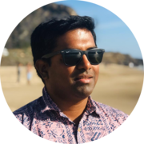

# Deepak Bhaskaran  
Software Engineer
🌉 San Francisco, CA

Email: b[my_first_name]23@gmail.com  
LinkedIn: [dbhaskaran](https://www.linkedin.com/in/dbhaskaran/)

 
 
## <b>About Me</b>

              

To this end, we develop novel spectroscopic-imaging scanning tunneling microscopy (SI-STM) tools to visualize the relevant quantum mechanical degrees of freedom. We want to be able to build the perfect instruments to answer the  scientific questions we deem most important (see [Research](research)).

We are located at Leiden University, the birthplace of superconductivity and home to Kamerlingh Onnes, Lorentz, Huygens, Einstein, de Sitter, and others (see e.g. [the wall of signatures from Ehrenfest lecturers](https://www.lorentz.leidenuniv.nl/history/colloquium/muur_heel.html)). We exchange ideas and work with our neighbors from [Quantum Matter & Optics](http://www.physics.leidenuniv.nl/qo-home), as well as with the colleagues from our [world-class theory section](https://www.lorentz.leidenuniv.nl).

